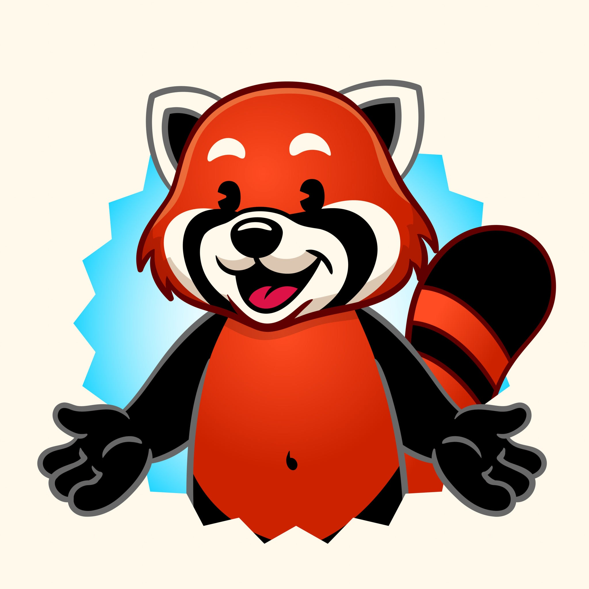

@chat.md
@UI.md
@desicion.md

Here is your definitive, one-shot decision pathway for the technical architecture, content pipeline, and creative directions.

## 1. LAN Discovery: mDNS + 4-Digit Fallback

**Decision:** Use mDNS (ZeroConf/Bonjour) as the primary discovery mechanism, backed by a manual 4-digit room code.

**Why:** Typing IP addresses on a tablet is a UX nightmare for kids (and annoying for parents). mDNS provides the "tap to join friend" magic as long as devices are on the same subnet. However, because school networks or complex home mesh routers frequently block mDNS multicast, you *must* have a fallback. A 4-digit alphanumeric code (e.g., `A7B2`) generated by the host device allows manual connection without exposing underlying network details.

---

## 2. AI State Persistence Schema

**Decision:** A structured relational core with a `JSONB` column for the highly variable interaction history. This gives you fast querying for dashboards while allowing the AI payload to evolve without constant schema migrations.

```sql
CREATE TABLE ai_exercise_sessions (
    session_id UUID PRIMARY KEY,
    user_id UUID NOT NULL,
    exercise_id UUID NOT NULL,
    status VARCHAR(50) NOT NULL, -- 'IN_PROGRESS', 'STUCK', 'COMPLETED', 'ABANDONED'
    current_hint_tier INT DEFAULT 0, -- 0=None, 1=Nudge, 2=Step-by-step, 3=Direct help
    
    -- JSONB captures the exact back-and-forth context for the LLM
    interaction_history JSONB NOT NULL DEFAULT '[]', 
    -- e.g. [{"timestamp": "...", "user_input": "4", "ai_response": "Close!", "hint_tier": 1}]
    
    -- JSONB array for quick analytics/personalization later
    concept_struggles JSONB DEFAULT '[]', 
    -- e.g. ["carry_over_addition", "fractions_denominator"]
    
    created_at TIMESTAMP WITH TIME ZONE DEFAULT NOW(),
    updated_at TIMESTAMP WITH TIME ZONE DEFAULT NOW()
);

```

---

## 3. Video Curation Pipeline

**Decision:** AI-Assisted First Pass -> Human Approval Gate.

**The Pipeline:**

1. **Ingestion & AI Tagging:** Feed the video transcript (via Whisper or similar) into an LLM.
* **Rule for "Tutorial" (How):** If the transcript contains sequential language ("First", "then", "step"), physical execution directions, and runs up to 7 minutes -> tag as `Tutorial`.
* **Rule for "Explanatory" (Why/What):** If it relies heavily on analogies, asks rhetorical questions ("Have you ever wondered?"), focuses on high-level concepts, and runs under 3 minutes -> tag as `Explanatory`.


2. **The Human Gate:** The AI outputs a pre-filled tag and a 1-sentence justification. A human curator reviews this, verifies the visual pacing is age-appropriate (which AI struggles with), and hits "Approve." Do not let AI auto-publish to a kids' platform.

---

## 4. The Font: Fredoka

**Decision:** Lock in **Fredoka**.

**Why:** While Baloo 2 has great bounce and character, Fredoka scales down to UI elements (buttons, input fields, tooltips) much more cleanly. It strikes the exact balance between "friendly and rounded for kids" and "highly legible geometric sans" needed for a digital product.

---

## 5. Mascot Commission Brief
Decision: A highly expressive, gender-neutral Red Panda.

 this is the mascot

The Brief:Subject: Red Panda (visually distinct from generic cats/dogs, has built-in "mask" features great for expressions).Style: 2.5D Cel-shaded (think Duolingo style: flat vibrant colors, thick outer strokes, soft internal drop-shadows to give it "pop" without full 3D rendering).Expression Set:Idle: Blinking, subtle ear twitch, looking slightly left/right.Happy: Eyes squeezed shut (^__^), hands raised.Thinking/Hint-mode: Tapping chin, floating lightbulb, eyes looking up and to the side.Celebrating: Mid-jump, mouth wide open, confetti overlay.Gentle-fail: Wincing slightly with a reassuring thumbs-up, single anime-style sweat drop.


**Decision:** A highly expressive, gender-neutral Red Panda.

**The Brief:**

* **Subject:** Red Panda (visually distinct from generic cats/dogs, has built-in "mask" features great for expressions).
* **Style:** 2.5D Cel-shaded (think Duolingo style: flat vibrant colors, thick outer strokes, soft internal drop-shadows to give it "pop" without full 3D rendering).
* **Expression Set:**
* *Idle:* Blinking, subtle ear twitch, looking slightly left/right.
* *Happy:* Eyes squeezed shut (`^__^`), hands raised.
* *Thinking/Hint-mode:* Tapping chin, floating lightbulb, eyes looking up and to the side.
* *Celebrating:* Mid-jump, mouth wide open, confetti overlay.
* *Gentle-fail:* Wincing slightly with a reassuring thumbs-up, single anime-style sweat drop.


---

## 6. Visual-Maturity Token Tiers

**Decision:** The UI must physically change its proportions and density between the youngest and oldest cohorts.

* **Tier 1 (Ages 6–8):**
* **Buttons:** `borderRadius: 24px` (fully rounded pills). High elevation/chunky drop shadows so they look deeply "tappable."
* **Layout:** Base typography at `18px`. Extreme reliance on iconography over text. Single-column layouts only.
* **Mascot:** High presence. Appears on almost every screen to guide the flow.


* **Tier 2 (Ages 9–13):**
* **Buttons:** `borderRadius: 8px` (rounded rectangles). Flat or very subtle gradients (low elevation). Introduction of a "dark mode" palette option.
* **Layout:** Base typography at `14px` or `16px`. Denser information hierarchy (two-column dashboard layouts, lists instead of giant cards).
* **Mascot:** Low presence. The mascot only appears during onboarding, major milestone achievements, or when the user explicitly taps a "Hint" button.


*(Ensure you also get a signed statement from your illustrator confirming the source and licensing rights of all bundled assets before merging them into your repository.)*                                                                                                                                                                                                                                                                                          Where should we start building? Everything else hangs off this foundation.
1.Foundation: design system + onboarding + home (Recommended)
Design-system CSS per UI.md, SQLite schema + IPC for profiles/progress, the onboarding flow (profile, career path, accessibility toggle), and the home dashboard. This is the spine everything else plugs into.
2.Curriculum engine + SQLite first
Skip visual polish; define the curriculum data model (paths, stages, concepts), the SQLite schema, and the stage-completion gate before any UI.
3.The block editor
Jump straight to the hardest/most distinctive component: the drag-and-drop block canvas and plain-code editor with run/evaluate.
4.LAN multiplayer
Start with the peer-to-peer race tech: mDNS discovery, room codes, match state sync over LAN